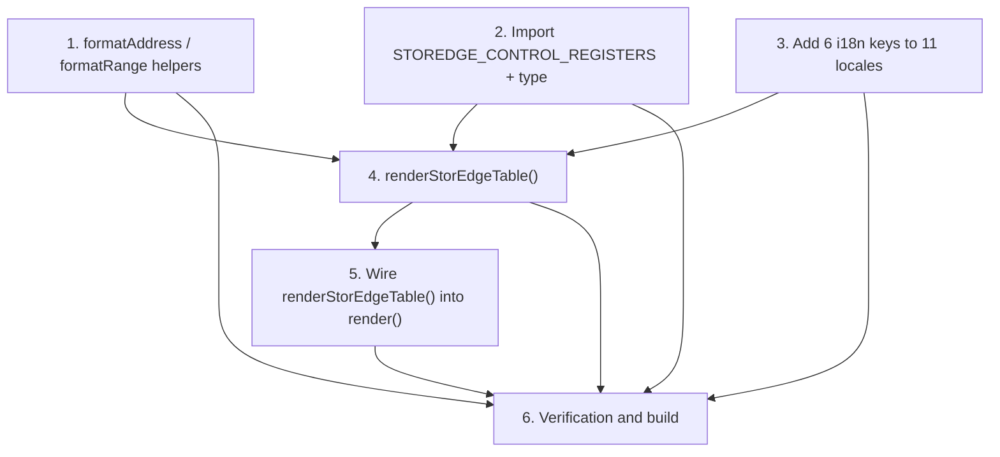

# Implementation Plan

## Overview

This plan adds a read-only "StorEdge Control Block" table to the admin `Settings.tsx` UI, sourced
from the existing `STOREDGE_CONTROL_REGISTERS` data. The work breaks down into three independent
preparatory pieces — the `formatAddress`/`formatRange` helpers (Task 1), the data import (Task 2),
and the eleven-locale i18n keys (Task 3) — which together enable the `renderStorEdgeTable()` method
(Task 4). That method is then wired into `render()` as a sibling of the existing SunSpec table
(Task 5), and the whole change is validated via typecheck, React build, i18n completeness, and the
existing adapter unit tests (Task 6). The feature consumes the StorEdge control map read-only and
must not alter the SunSpec read/poll model or the underlying register data.

## Tasks

- [x] 1. Add the `formatAddress` and `formatRange` formatting helpers to `Settings.tsx`
  - In `src-admin/src/components/Settings.tsx`, add two pure module-local functions (near the top of
    the file, after the imports and before/alongside the `styles` object) exactly as specified in the
    design "Formatting helpers" section.
  - `formatAddress(address: number): string` returns `` `0x${address.toString(16).toUpperCase().padStart(4, '0')}` `` so `0xe004 → "0xE004"` and `0xe010 → "0xE010"` (hex `0xExxx`, uppercase, zero-padded to 4 digits).
  - `formatRange(min: number, max: number): string` returns `` `${min}..${maxLabel}` `` where `maxLabel = max === Number.MAX_VALUE ? '∞' : String(max)`, so `(0, 4) → "0..4"`, `(0, Number.MAX_VALUE) → "0..∞"`, `(0, 86400) → "0..86400"`.
  - Do NOT run the range string through `I18n.t`; `∞` is a language-neutral token needing no key.
  - _Design: "Formatting helpers", Correctness Property 2 (address hex), Correctness Property 4 (readable unbounded max)_
  - _Requirements: 2.2, 2.3, 2.7, 2.9_

- [x] 2. Import `STOREDGE_CONTROL_REGISTERS` and the `StorEdgeControlRegisterDef` type
  - In `src-admin/src/components/Settings.tsx`, add these imports alongside the existing `../../../src/lib/sunspec-map` import (Vite transpiles the adapter TS sources on the fly; no build step needed):
    - `import { STOREDGE_CONTROL_REGISTERS } from '../../../src/lib/storedge-control-map';`
    - `import type { StorEdgeControlRegisterDef } from '../../../src/lib/storedge-control-map';`
  - Do NOT modify `STOREDGE_CONTROL_REGISTERS` or the SunSpec read/poll model.
  - _Design: "Components and Interfaces → Data source"_
  - _Requirements: 1.4, 7.3_

- [x] 3. Add the 6 new i18n keys to all eleven locale files
  - Add each of the six new keys below to every file in `src-admin/src/i18n/` (`en`, `de`, `ru`, `pt`, `nl`, `fr`, `it`, `es`, `pl`, `uk`, `zh-cn`). Do NOT re-add `Name` — reuse the existing key.
  - Keys: `StorEdge Control Block`, `Address`, `Encoding`, `Unit`, `Range`, `Function code`, `No StorEdge control registers available` (7 keys total for the section title + 5 new column headers + empty-state message; `Name` reused).
  - Use the en/de values from the design "i18n Keys" table (`en`: identical to the key; `de`: `Adresse`, `Kodierung`, `Einheit`, `Bereich`, `Funktionscode`, `Keine StorEdge-Steuerregister verfügbar`; `StorEdge Control Block` kept identical as a brand term). Translate the remaining nine locales per each file's existing conventions, keeping `StorEdge Control Block` identical across all locales.
  - _Design: "i18n Keys", Correctness Property 6 (localization via `I18n.t`, reuse `Name`)_
  - _Requirements: 5.1, 5.2, 5.3, 2.1_

- [x] 4. Implement the `renderStorEdgeTable()` method
  - Add a new private method `renderStorEdgeTable(): React.JSX.Element` in the `Settings` class, placed alongside the existing `renderValueTable()`.
  - Return its own `<Paper style={styles.tableWrapper}>` (reuses the shared style; `marginTop: 24` gives natural separation from the SunSpec paper).
  - Inside the `Paper`, render a `<Typography variant="h6" style={{ padding: 8 }}>{I18n.t('StorEdge Control Block')}</Typography>` title matching the SunSpec title pattern.
  - Render a single `<Accordion>` that is NOT `defaultExpanded` (collapsed by default, matching the Meter/Battery accordions), with `<AccordionSummary expandIcon={<ExpandMoreIcon />}>` showing `` `${I18n.t('StorEdge Control Block')} (${STOREDGE_CONTROL_REGISTERS.length})` `` → e.g. `StorEdge Control Block (9)`.
  - Wrap the table in `<AccordionDetails style={styles.accordionDetails}>` then `<div style={styles.scrollBox}>` then `<Table size="small">`, mirroring the SunSpec primitives.
  - `TableHead` has exactly 6 columns in order: `I18n.t('Name')`, `I18n.t('Address')`, `I18n.t('Encoding')`, `I18n.t('Unit')`, `I18n.t('Range')`, `I18n.t('Function code')`.
  - `TableBody`: when `STOREDGE_CONTROL_REGISTERS.length === 0`, render a single `<TableRow>` with one `<TableCell colSpan={6}>{I18n.t('No StorEdge control registers available')}</TableCell>`; otherwise `STOREDGE_CONTROL_REGISTERS.map(def => ...)` producing one `<TableRow key={def.name}>` per entry in array order with cells: `def.name`, `formatAddress(def.address)`, `def.kind`, `def.unit ?? ''`, `formatRange(def.min, def.max)`, `def.fc`.
  - Render display-only: no editable inputs, no Modbus read/write/`sendTo`.
  - _Design: "Placement and container", "Table structure", "Columns"; Correctness Properties 1, 3, 5, 7_
  - _Requirements: 1.1, 1.2, 1.3, 1.4, 1.5, 2.1, 2.2, 2.4, 2.5, 2.6, 2.7, 2.8, 3.1, 3.2, 3.3, 4.1, 4.2, 6.1, 6.3_

- [x] 5. Wire `renderStorEdgeTable()` into `render()`
  - In `render()`, immediately after the existing `{this.renderValueTable()}` line (still inside the `<form>`), add `{this.renderStorEdgeTable()}` as a sibling call.
  - Leave `renderValueTable()`, the connection fields, Test Connection button, and validation untouched so both sections are reachable and visually distinct.
  - _Design: "Placement and container"; Correctness Property 8 (preservation)_
  - _Requirements: 6.2, 7.1, 7.2_

- [x] 6. Verification and build
  - Run the admin typecheck/build: `npm run check` (runs `tsc --noEmit -p src-admin/tsconfig.json`) and `npm run build:react`. Confirm the new import resolves, all `StorEdgeControlRegisterDef` field accesses (`name`, `address`, `kind`, `unit`, `min`, `max`, `fc`) are type-correct, `renderStorEdgeTable()` compiles, and nothing else regressed.
  - Run an i18n key-completeness check across all 11 files in `src-admin/src/i18n/`: confirm each of the six new keys (plus reused `Name`) exists in every locale file with no missing keys.
  - Run the adapter unit tests `npm run test:ts` and confirm the existing `src/lib/storedge-control-map` tests still pass (this feature consumes that data read-only and must not change its shape or the `Number.MAX_VALUE` max on `storageAcChargeLimit`).
  - Fix any errors surfaced, then re-run until all three checks pass. Ask the user if questions arise.
  - _Design: "Testing Strategy"; Correctness Property 8 (preservation)_
  - _Requirements: 5.2, 7.1, 7.2, 7.3_

## Task Dependency Graph

Tasks 1, 2, and 3 are independent and may be done in any order. Task 4 depends on all three of them,
Task 5 depends on Task 4, and Task 6 depends on all preceding tasks (1–5).



```json
{
  "waves": [
    { "wave": 1, "tasks": ["1", "2", "3"], "dependsOn": [] },
    { "wave": 2, "tasks": ["4"], "dependsOn": ["1", "2", "3"] },
    { "wave": 3, "tasks": ["5"], "dependsOn": ["4"] },
    { "wave": 4, "tasks": ["6"], "dependsOn": ["1", "2", "3", "4", "5"] }
  ]
}
```

Textual dependency list:

- Task 1 → (no prerequisites)
- Task 2 → (no prerequisites)
- Task 3 → (no prerequisites)
- Task 4 → depends on Tasks 1, 2, 3
- Task 5 → depends on Task 4
- Task 6 → depends on Tasks 1, 2, 3, 4, 5

## Notes

- Verification uses the real npm scripts confirmed present in `package.json`:
  - `npm run check` — TypeScript typecheck; runs `tsc --noEmit && tsc --noEmit -p src-admin/tsconfig.json`, so it covers the `src-admin` admin sources.
  - `npm run build:react` — builds the admin React UI (`node tasks`).
  - `npm run test:ts` — runs the adapter unit tests (`mocha --config test/mocharc.custom.json src/**/*.test.ts`), which include the existing `src/lib/storedge-control-map` tests.
- There is no admin-UI test harness in this project, so the correctness properties are validated via
  typecheck/build (`npm run check` + `npm run build:react`), i18n key-completeness across the 11
  locale files, and the existing `storedge-control-map` unit tests (`npm run test:ts`) rather than
  through dedicated UI tests.
