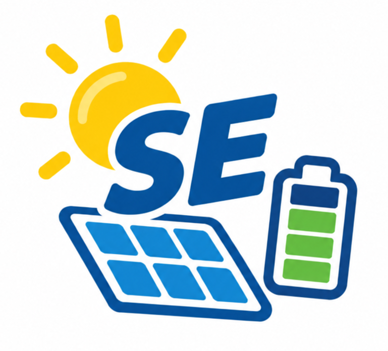

# ioBroker.sehybrid

**Tests:** 

> ⚠️ **Work in progress — use at your own risk.** This adapter is under active development. Interfaces and state
> trees may change between versions.

## SolarEdge hybrid inverter adapter for ioBroker

Monitors and controls SolarEdge hybrid inverters over **Modbus TCP** (SunSpec). It reads PV, battery and
operational data from the inverter and exposes it as ioBroker states. It also exposes the inverter's StorEdge
**Global StorEdge Control Block** as a writable set of states, so you (or your own ioBroker scripts) can drive
Remote Control and related storage settings directly (see [StorEdge control block](#storedge-control-block)).

## Requirements

- A SolarEdge hybrid inverter with **Modbus TCP enabled** and reachable on your network.
- ioBroker with `js-controller` >= 6.0.11 and `admin` >= 7.0.23.

> Modbus TCP is usually enabled in the inverter's SetApp / installer menu. The default TCP port is **502** or **1502**.

## Installation

Install **sehybrid** from the ioBroker admin (Adapters tab), then create an instance.

## Configuration

Open the instance settings and configure the connection to your inverter:

| Setting | Default | Description |
|---------|---------|-------------|
| Host | *(empty)* | IP address or hostname of the inverter. Polling does not start until this is set. |
| Port | `502` or `1502` | Modbus TCP port of the inverter. |
| Unit ID | `1` | Modbus unit / slave ID of the inverter. |
| Poll interval | `30` | How often (in seconds) the adapter reads data from the inverter. |

The settings page includes a **Test connection** button that verifies the adapter can reach the inverter and
reads its manufacturer and model before you save.

There is no separate configuration for the StorEdge control block — it is always created and always active,
independent of any setting (see [StorEdge control block](#storedge-control-block)).

## States

The adapter organizes the values it reads into channels:

- **info.connection** — `true` while the adapter is successfully polling the inverter, `false` otherwise.
- **Inverter** — power, energy, AC/DC measurements and status from the inverter.
- **Meter** — data from connected SunSpec meters (import/export, power, energy).
- **Battery** — state of charge, power, temperature and status for connected batteries.
- **StorEdgeControlBlock** — the nine StorEdge control registers, always created, read and write (see below).

The exact list of states depends on your inverter model and the meters/batteries attached to it.

## StorEdge control block

The adapter always exposes the inverter's **Global StorEdge Control Block** — nine manufacturer-documented
registers starting at `0xE004` — as a flat `StorEdgeControlBlock` channel. This is created unconditionally on
every adapter start; there is no enable switch and no configuration for it.

Every poll cycle, all nine states are refreshed with the inverter's live values (`ack=true`). Every one of the
nine states also accepts writes: set a new value (`ack=false`) from a script, the admin object tree, or any
other adapter, and it is range-validated and written straight through to the inverter via Modbus:

- `StorEdgeControlBlock.storageControlMode` — raw `0xE004`, Storage Control Mode (0–4)
- `StorEdgeControlBlock.storageAcChargePolicy` — raw `0xE005`, AC Charge Policy (0–3)
- `StorEdgeControlBlock.storageAcChargeLimit` — raw `0xE006`, AC Charge Limit (kWh)
- `StorEdgeControlBlock.storageBackupReservedSetting` — raw `0xE008`, Backup Reserved Setting (%, 0–100)
- `StorEdgeControlBlock.storageChargeDischargeDefaultMode` — raw `0xE00A`, Charge/Discharge Default Mode (0–7)
- `StorEdgeControlBlock.remoteControlCommandTimeout` — raw `0xE00B`, Remote Control Command Timeout (s)
- `StorEdgeControlBlock.remoteControlCommandMode` — raw `0xE00D`, Remote Control Command Mode (0–7)
- `StorEdgeControlBlock.remoteControlChargeLimit` — raw `0xE00E`, Remote Control Charge Limit (W)
- `StorEdgeControlBlock.remoteControlDischargeLimit` — raw `0xE010`, Remote Control Discharge Limit (W)

Each state's accepted range is documented on the object itself (`common.min`/`common.max` in the admin object
tree). A write outside that range is rejected: the adapter logs an error, does not write to the inverter, and
the state keeps its previous value. There is no write-only-if-changed suppression — every valid write you make
is sent to the inverter, every time.

The adapter itself never computes or drives a value into these registers on its own (there is no built-in
consumption-based automation). Driving these registers to implement something like Remote Control discharge
limiting based on house/wallbox consumption is up to your own ioBroker scripts, which can simply write to
`StorEdgeControlBlock.remoteControlDischargeLimit` (and the other registers Remote Control mode requires) like
any other writable state.

> **Portal prerequisite for Remote Control:** if you intend to use Storage Control Mode `4` (Remote Control),
> disable the StorEdge storage profile in the SolarEdge monitoring portal / SetApp (Admin → Energy Manager →
> Storage Profile) first. Otherwise the inverter's own cloud profile fights the Modbus commands and reverts
> Remote Control back to *Maximize Self Consumption* after about 10 seconds. This is a manual, one-time step on
> the inverter side; the adapter cannot do it for you. This mirrors the community-documented fix
> (see [binsentsu/home-assistant-solaredge-modbus #130](https://github.com/binsentsu/home-assistant-solaredge-modbus/issues/130)).

> **Float encoding note:** the StorEdge power-control registers use *Big Endian, word-swapped* float32
> (bytes big-endian, the two 16-bit words swapped — the low word first). This matches the "Big Endian Word
> swap" datatype in the standard ioBroker Modbus adapter and was verified live against the inverter.

> **Safety:** writing to `StorEdgeControlBlock` states writes directly to your inverter's battery-control
> registers. Verify behavior carefully before relying on any automation built on top of it. This adapter is a
> work-in-progress; use at your own risk.

## Troubleshooting

- **No data / `info.connection` stays `false`** — check that the Host is set correctly, Modbus TCP is enabled
  on the inverter, and port `502` or `1502` is reachable from your ioBroker host.
- **Connection errors in the log** — verify the Unit ID matches your inverter and that no other client is
  holding the single Modbus TCP connection the inverter allows.
- **Remote Control reverts to Maximize Self Consumption after a few seconds** — you have not disabled the
  StorEdge storage profile in the SolarEdge monitoring portal / SetApp. See the prerequisite above.
- **A write to a `StorEdgeControlBlock` state has no effect** — check the adapter log; the value is likely
  outside that state's documented range (visible as `common.min`/`common.max` on the object) and was rejected
  before being sent to the inverter.

## Support

Please report issues at [GitHub Issues](https://github.com/heresiarch/ioBroker.sehybrid/issues).

Developers: see [README_dev.md](README_dev.md) for build, test and release instructions.

## Changelog

<!--
    Placeholder for the next version (at the beginning of the line):
    ### **WORK IN PROGRESS**
-->
### **WORK IN PROGRESS**
* (René Meyer) Pending changes for the next release

### 1.0.6 (2026-09-23)
* (René Meyer) The compiled `build/` folder is now committed to the repository so the adapter can be installed directly from GitHub; dropped the `common.nogit` flag and the `prepublishOnly` build hook
* (René Meyer) Made the adapter logo square (512x512) and reduced its size in the README

### 1.0.5 (2026-09-22)
* (René Meyer) Adopted the canonical full-TypeScript adapter layout: `build/` is no longer committed; the npm package ships it via `prepublishOnly` and `common.nogit`

### 1.0.4 (2026-09-22)
* (René Meyer) Fixed the admin icon and static admin files being excluded from the repository
* (René Meyer) Upgraded the admin UI build tooling to Vite 8
* (René Meyer) Various repository/CI cleanups to satisfy the ioBroker adapter checker

### 1.0.3 (2026-09-22)
- (ioBroker-Bot) Adapter requires admin >= 7.8.23 now.

### 1.0.2 (2026-09-22)
* (René Meyer) Removed the `install:src-admin` npm script from package.json; the package now contains no install-related scripts at all (addresses issue #6)
* (René Meyer) The CI lint job installs admin UI dependencies inline in the workflow instead of via a package.json script

[Older changelogs can be found there](CHANGELOG_OLD.md)

## License

Copyright (c) 2026 René Meyer <heresiarch@online.de>
see [LICENSE](LICENSE)
